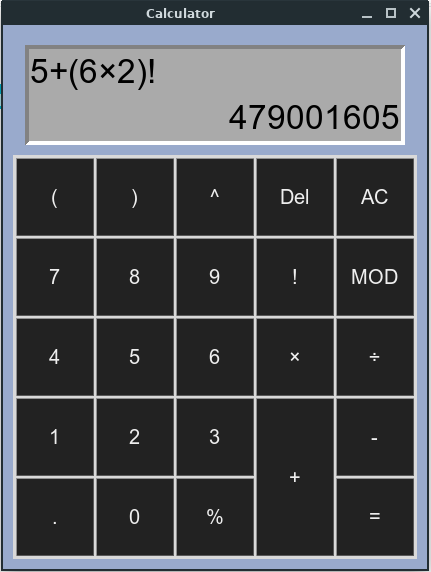

# Calculator

A simple GUI based calculator for simple mathematical operations.

## :crystal_ball: Prerequisites

You need tkinter to run this.
If you are using windows you are ready to go.
For Linux, run this code in terminal if you dont have tkinter installed.
```
sudo apt-get install python3-tk
```

## :camera: Screenshot



## :floppy_disk: Get Started

- clone this repo by typing this command in terminal
```
git clone git@github.com:rohitjoshi21/Calculator.git
```
- when you have cloned the repo, simply run the .py file in terminal 
```
python3 Calculator.py
```

## :hammer: Built With

- [tkinter](https://github.com/topics/tkinter) - The GUI framework for Python

## :octocat: Author

[@rohitjoshi21](https://github.com/rohitjoshi21)
